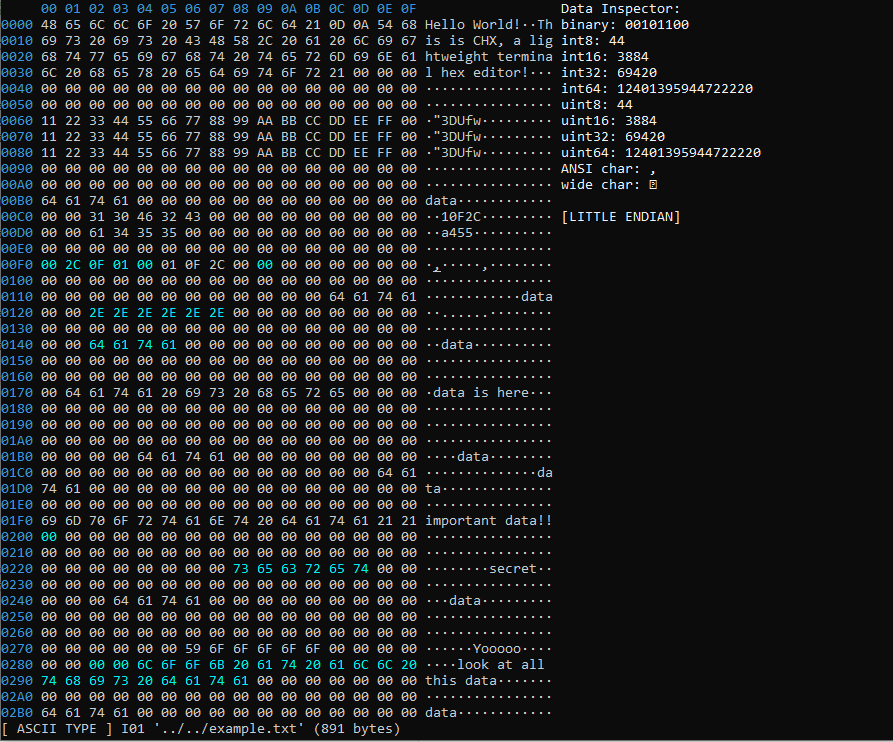

# CHX
A lightweight terminal hex editor.  
usage: `chx <filepath>`

## Quickstart Guide
to install chx:  
`git clone https://github.com/nicholascok/CHX.git chx`  
`cd chx`  
`make`  
`sudo make install`  

(optional)  
to remove source files:  
`cd ..`  
`rm -r chx`  

## Example

## Default Implementations
  ### Instances
  CHX supports the ability to have several files open at once. Each open file is referred to as an instance. To create a new instance within CHX use the interpreter command `open`, and to close an instance, use the interpreter command `close`. To switch to an instance, use the interpreter command `to` (see Interpreter Commands). The next and previous instances can be accessed by ctrl + page up / ctrl + page down, respectively.
  
  ### Typing Modes
  | Mode          | Default Keybinding | Valid Characters | Description |
  |:-------------:|:------------------:|:----------------:|:------------|
  | **INSERT**        | I                  | Hex Characters   | characters are inserted into the file. by default, this will shift the rest of the file contents and change the filesize. (this can be disabled, if desired, in which case, inserting into the file results in data 'falling off' the end of the file, and deleting from the file results in data at the end of the file being filled with zeros) |
  | **ASCII INSERT**  | SHIFT + I          | All Characters   | characters are inserted into the file. Like with INSERT mode, this shifts the file contents and changes the filesize. However, unlike INSERT mode, this behaviour cannot be changed. |
  | **REPLACE**       | R                  | Hex Characters   | characters overwrite file content, typing does not move the cursor. deleting from the file is the same as replacing with zeros. |
  | **ASCII REPLACE** | SHIFT + R          | All Characters   | characters overwrite file content, typing does not move the cursor. deleting from the file is the same as replacing with zeros. |
  | **TYPE**          | T                  | Hex Characters   | characters overwrite file content, typing moves the cursor. deleting from the file fills the void with zeros. |
  | **ASCII TYPE**    | SHIFT + T          | All Characters   | characters overwrite file content, typing moves the cursor. deleting from the file fills the void with zeros. |
  
  ### Keybindings
  | Global Keybindings     |                |
  |:-----------------------|:---------------|
  | **Keybinding**         | **Decription** |
  | escape | returns to command mode, exits various dialoges. |
  | up arraw | moves the cursor up by one row |
  | down arrow | moves the cursor down by one row |
  | right arrow | moves the cursor to the beginning of the next byte |
  | left arrow | moves the cursor to the beginning of the previous byte |
  | alt + up arraw | moves the cursor up by five row |
  | alt + down arrow | moves the cursor down by five row |
  | alt + right arrow | moves the cursor forward five bytes |
  | alt + left arrow | moves the cursor backward byte bytes |
  | ctrl + up arraw | moves the cursor up by one row |
  | ctrl + down arrow | moves the cursor down by one row |
  | ctrl + right arrow | moves the cursor to the next hex character |
  | ctrl + left arrow | moves the cursor to the beginning of the previous hex character |
  | shift + up arraw | extends selection up by one row |
  | shift + down arrow | extends selection down by one row |
  | shift + right arrow | extends selection to the next byte |
  | shift + left arrow | extends selection to the previous byte |
  | ctrl + y | copy selection |
  | ctrl + p | paste selection after cursor |
  | ctrl + shift + p | paste selection before cursor |
  | ctrl + i | toggle insert mode |
  | ctrl + r | toggle replace mode |
  | ctrl + t | toggle type mode |
  | ctrl + e | toggle endianness |
  | ctrl + w | open save-as dialoge |
  | ctrl + u | revert all unsaved changes |
  | ctrl + x | exit the program, discarding any unsaved changes |
  | delete | replaces the hex char at the cursor position with 0 |
  | page up | scrolls the file contents up |
  | page down | scrolls the file contents down |
  | ctrl + page up | switches to subsequent instance |
  | ctrl + page down | switches to previous instance |
  
  Note: HJKL also work in place of the arrow keys. in lite versions of CHX, HJKL must be used for selecting, and arrow keys work as the ctrl versions do here.
  
  | Command Mode Keybindings     |                |
  |:-----------------------------|:---------------|
  | **Keybinding**               | **Decription** |
  | y | copy selection |
  | p | paste selection after cursor |
  | x | remove current byte at cursor position, shift file contents |
  | v | remove hex char at cursor position, shift file contents |
  | g | move cursor to beginning of file |
  | d | fill selected area with zeros |
  | shift + p | paste selection before cursor |
  | shift + v | remove hex char before cursor position, shift file contents, and update cursor |
  | shift + x | remove byte before cursor position, shift file contents, and update cursor |
  | shift + g | move cursor to end of file |
  | shift + d | remove selection, shift file contents |
  | u | revert all unsaved changes |
  | q | quit program, prompt if there are any unsaved changes |
  | . | repeat last action |
  | ^ | move cursor to start of line |
  | $ | move cursor to end of line |
  | : | open command interpreter |
  
  ### Interpreter Commands
  If a decimal number or hex offset (prefixed with 0x) is entered into the interpreter, the cursor jumps to that byte, otherwise the command is searched for in the list of interpreter commands, void first.
  | Command | Alias(es) | Description |
  |:--------|:--------|:------------|
  | `open <filepath>` | `o` | opens a new file and switches to the instance. |
  | `close <instance_num>` | `c` | closes the specified instance: if no instance is specified, the current instance is closed. |
  | `to <instance_num>` | none | switches to the specified instance. |
  | `switch <filepath>` | `sw`, `s` | opens the specified filepath, replacing the current instance. |
  | `find <string>` | `f`, `/` | moves the cursor to the next occurance of the specified string. |
  | `count <string>` | `cnt` | counts the number of occurances of the specified string in the file. |
  | `save <new_filename>` | `w` | saves the file under the specified filename: if no filename is specified, the filename is not changed. |
  | `ge <'l' or 'b'>` | none | globally sets the endianness of all open files. |
  | `se` | none | toggles between big and little endian interpretations of data. |
  | `ti` | none | toggles data inspector visibility. |
  | `tp` | none | toggles ASCII preview visibility. |
  | `exit` | `q!` | exits the program without saving. |
  | `quit` | `q` | if there are unsaved changes in the file, the user is prompted to save the current instance first, then exits the program. |
  | `wq` | none | saves the current instance and exits the program. |
  
  ### Editing the Layout of CHX
  There are a number of options that can be changed in config.h; many of these options can also be changed live from within chx through the use of the `cfg` and `gcfg` interpreter commands. The `cfg` command affects the layout of the current instance and the `gcfg` command affects the layout of all currently open instances. The format of both commands is the same, and outlined below:  
  `cfg <property> <value>`  
  There are currently four properties that can be cahnged from within CHX:
  | Property Name | Reference | Default Value | Description|
  |:--------------|:----------|:-------------:|:-----------|
  | Row Number Length | `rnl` | 4 | changes the minimum row number length (in digits) |
  | Bytes per Row | `bpr` | 16 | changes the number of bytes displayed in each row |
  | Bytes in Group | `big` | 1 | changes the number of bytes displayed in each group |
  | Group Spacing | `gs` | 1 | changes the spacing between byte groups and layout features |
  
## Adding Keybinds
  Add keybinds to either the global or command mode array in config.h using the following format:  
  `[<key>] = <func_ptr>,`  
    
  You can create your own functions by adding them to either config.h or chx_defaults.c using the following format:  
  `void <my_func>(void) { /* code... */ }`
    
  Most keys are referenced by their literal value, for example, the A key is referenced by `'a'`
  and shift + A is referenced by `'A'`. In other cases, such as for the arrow keys, keys are referenced
  using a macro:
| Reference   | Key           |
| ----------- |:-------------:|
| KEY_UP      | up arrow      |
| KEY_DOWN    | down arrow    |
| KEY_RIGHT   | right arrow   |
| KEY_LEFT    | left arrow    |
| KEY_ESCAPE  | escape key    |
| KEY_PG_UP   | page up key   |
| KEY_PG_DN   | page down key |
| KEY_HOME    | home key      |
| KEY_END     | end key       |
| KEY_INSERT  | insert key    |
| KEY_DELETE  | delete key    |
| KEY_ENTER   | enter key     |
| KEY_TAB     | tab key       |
  
  For keys which are modified by alt or ctrl, put the key inside of the corresponding function. For example, alt + m is referenced by `CHX_ALT('m')`, 
  shift + alt + m is referenced by `CHX_ALT('M')`, and shift + delete is referenced by `CHX_SHIFT(KEY_DELETE)`.
  There are four of these functions:  
  - `CHX_CTRL(<key>)`
  - `CHX_CTRL_M(<key>)`
  - `CHX_ALT(<key>)`
  - `CHX_SHIFT(<key>)`
  
  Note that there is not currently support for multiple modifiers.
  
## Adding Interpreter Commands
  ### Void Interpreter Commands
  To add a void interpreter command, first create your function by adding it to either config.h or chx_defaults.c using the following format:  
  `void <my_func>(void) { /* code... */ }`  
  
  Then, add it to the list of void interpreter commands in config.h using the following syntax:  
  `(struct chx_void_command) {<func_ptr>, "<command_str>"},`  
  
  ### Interpreter Commands With Parameters
  To add an interpreter command with parameters, first create your function by adding it to either config.h or chx_defaults.c as follows:  
  `void <my_func>(char <num_params>, char** <param_list>) { /* code... */ }`  
  
  Then, add it to the list of interpreter commands in config.h using the following syntax:  
  `(struct chx_command) {<func_ptr>, "<command_str>"},`  
  
## Exclusion List
  By default, CHX stores the function pointer of your previous action (function called by key press or interpreter command entered).
  To exclude a function from being set as your last action, add it to the exclusion list in config.h.
